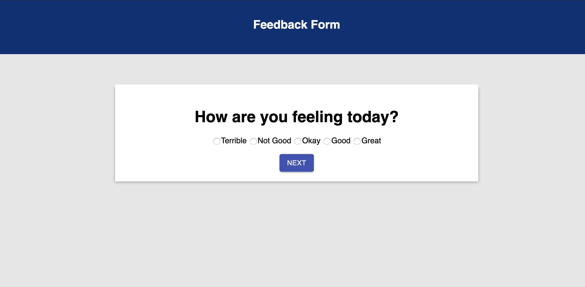
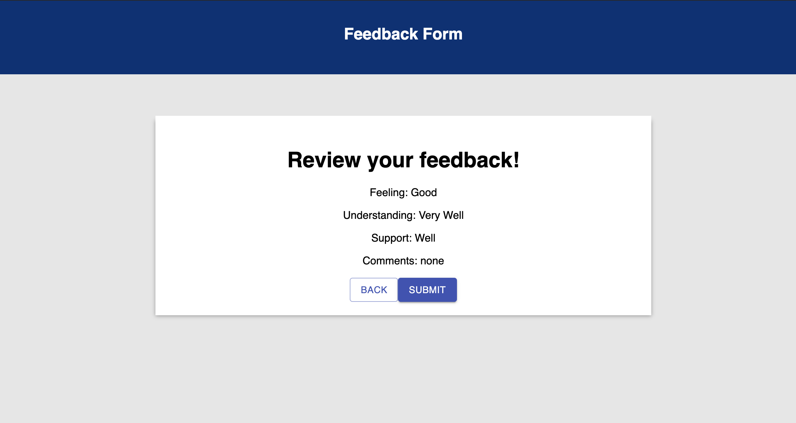

# Feedback Form

This app allows users to give feedback on their experience. After all questions are answered, a summary of input is displayed. The user is then able to go back and edit responses or submit the feedback to the database.

Each page is a separate component so in order to share data between them I used redux. This allowed me to store the user input and display it on the review feedback page. 

## Prerequisites

- Node

## Built With

- React
